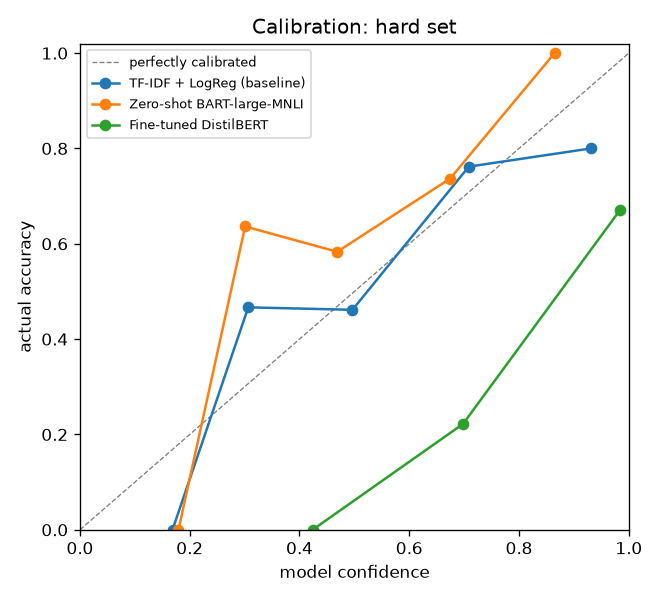

# 🎫 Evaluating AI Ticket Routing

**An evaluation project: which model should route a SaaS company's support tickets, and should we automate at all?**

I compared three models on routing support tickets to the right team, using **six evals**. On the standard benchmark, the fine-tuned model looks almost perfect (99.9%). On 80 hand-written realistic tickets it falls to 61%, makes 68% of its mistakes at ≥90% confidence, and costs more than having humans triage every ticket. **The model that wins the benchmark is the wrong model to ship.**



## Key findings
1. **The benchmark is saturated.** Both supervised models score 99.6–99.9% on Bitext's templated tickets. Accuracy there can't separate good models from bad ones.
2. **The ranking flips on realistic tickets.** On the hand-written hard set, zero-shot BART costs **0.70 per ticket**. Fine-tuned DistilBERT costs **1.69**, more than all-human triage (1.00). On high-urgency tickets zero-shot gets 70% right and DistilBERT 39%.
3. **Confidence stops meaning anything off-distribution.** DistilBERT is the best-calibrated model on the benchmark (ECE 0.003) and the worst on the hard set (ECE 0.333). 68% of its hard-set mistakes come at ≥90% confidence, so **no escalation threshold can catch them**. Zero-shot's mistakes all come at lower confidence, so escalation can.
4. **The most common errors aren't the costliest.** Zero-shot's most frequent mistake (general questions tagged as complaints, 109 tickets) is cheap. Cancellations sent to refund or billing are rarer and cost about 3× as much in total.
5. **The right threshold depends on what a human's time costs.** With human triage priced at 1.0, escalating zero-shot's tickets never pays. At 0.2, the best policy escalates 78% of them and accuracy on the rest rises from 65% to 88%.
6. **The keyword urgency rule misses most urgent tickets.** It agrees with my hand labels 66% of the time, but catches only 26% of the high-urgency tickets.

## The eval suite
| # | Eval | Question it answers | Where |
|---|---|---|---|
| 1 | **Accuracy** (+ high-urgency slice) | How often is it right, including on the tickets that matter most? | `metrics.accuracy` |
| 2 | **Cost-weighted confusion matrix** | Which mistakes cost the most, not just which happen most? | `metrics.cost_weighted_confusion` |
| 3 | **Escalation-threshold sweep** | Below what confidence should a human take over, given what humans and mistakes cost? | `metrics.sweep_thresholds` |
| 4 | **Hand-written hard set** (80 tickets, 7 difficulty tags) | Does it hold up on messy, realistic, out-of-distribution tickets? | [`evals/hard_tickets.csv`](evals/README.md) |
| 5 | **Calibration** (ECE, reliability diagrams, confident-error share) | When it says "90% sure", is it right 90% of the time? Can escalation catch its errors? | `metrics.expected_calibration_error` |
| 6 | **Latency** | Is it fast enough to run on every ticket? | `predict.py` |

**Eval design choices**
- **No tuning on test.** The escalation threshold is chosen on the validation split and reported on the test split and the hard set.
- **Fair comparison.** All models are scored on exactly the same 1,001 test tickets (zero-shot ran on a stratified sample).
- **Business-set costs.** Mistake costs are inputs that a PM sets with Support and Finance, not ML defaults. They're editable live in the app.
- **Hand-labelled urgency on the hard set,** so the cost weighting there doesn't depend on the keyword rule being evaluated.

## Results
| | TF-IDF baseline | Zero-shot BART | Fine-tuned DistilBERT |
|---|---:|---:|---:|
| **Benchmark** (Bitext, 1,001 test tickets) | | | |
| Accuracy | 99.6% | 64.5% | **99.9%** |
| Cost / ticket (all-human = 1.00) | 0.013 | 0.487 | **0.006** |
| Calibration error (ECE) | 0.014 | 0.136 | **0.003** |
| **Hard set** (80 hand-written tickets) | | | |
| Accuracy | **66.2%** | 65.0% | 61.3% |
| Accuracy on high-urgency tickets | 48% | **70%** | 39% |
| Cost / ticket (all-human = 1.00) | 1.63 | **0.70** | 1.69 |
| Calibration error (ECE) | **0.101** | 0.170 | 0.333 |
| Mistakes made at ≥90% confidence | 11% | **0%** | 68% |
| **Latency** (Apple M-series) | <0.01 ms | 64 ms | 0.6 ms |

Accuracy on the hard set by difficulty tag:

| Tag | n | TF-IDF | Zero-shot | DistilBERT |
|---|---:|---:|---:|---:|
| sarcasm | 6 | 33% | **83%** | 33% |
| out-of-distribution (API errors, crashes) | 6 | 0% | **33%** | 0% |
| indirect | 20 | 55% | **65%** | 60% |
| SaaS terms | 20 | 50% | **55%** | 45% |
| typo | 10 | **70%** | **70%** | 60% |
| terse | 13 | **85%** | 77% | 69% |

The full report, with every chart, is generated by `make eval` into `outputs/report.md`.

## What I'd recommend
Don't ship the benchmark winner on these numbers. The next steps are:
1. **Label 200–500 real tickets** and re-run this suite. The hard set says Bitext doesn't predict real performance.
2. **Fine-tune on more realistic, varied data.** The fine-tuned models collapsed exactly where Bitext has no coverage: sarcasm, product bugs, SaaS jargon.
3. **Choose the model on hard-set cost and calibration, not benchmark accuracy.** A model that knows when it's unsure is safer to automate, because its mistakes can be escalated.

## What it does
It reads a support ticket and labels its **intent** (8 SaaS intents: billing, refund, cancellation, account, technical issue, orders, complaint, general) and **urgency**. It then routes the ticket to a team, or **escalates it to a human** when confidence falls below the threshold.

| | |
|---|---|
| **Models** | TF-IDF + logistic regression (baseline) · zero-shot `facebook/bart-large-mnli` · fine-tuned `distilbert-base-uncased` |
| **Data** | [Bitext customer-support dataset](https://huggingface.co/datasets/bitext/Bitext-customer-support-llm-chatbot-training-dataset): ~27k synthetic tickets, 27 intents regrouped into 8 · plus 80 hand-written hard tickets |

## Quickstart
```bash
make setup   # uv sync
make demo    # ~1 min cold: data + baseline, then opens the app
```
The app shows real results for all three models straight away, including the hard set, using committed sample predictions in `demo_assets/`.

**Run the evals yourself:**
```bash
make eval                                   # full report → outputs/report.md (+ charts)
make brief                                  # PM decision brief → outputs/decision-brief.md
uv run ticket-eval --human-cost 0.2         # what if human triage is cheap?
uv run ticket-eval --min-auto-accuracy 0.99 # require 99% accuracy on auto-routed tickets
uv run ticket-predict --model tfidf --splits hard   # re-score a model on the hard set
make train && make predict && make eval     # full pipeline (DistilBERT ~10-15 min; zero-shot downloads 1.6 GB)
```

## Demo in 5 minutes
1. **Route a ticket**: click *Angry cancellation*. It comes back as `cancellation`, **HIGH** urgency, routed to **retention**.
2. **Compare models**: scroll to *Stress test*. Benchmark accuracy collapses on the hand-written tickets, and the ranking flips.
3. **Cost explorer**: pick zero-shot and slide *Human triage* from 1.0 down to 0.2 to watch the escalation policy change.
4. **Error review**: read the tickets behind the most expensive mistakes.
5. **Download decision brief**: it includes an automatic robustness warning.

## How the cost-weighted eval works
- Every (true intent → predicted intent) mistake costs the **severity** of the true intent: cancellation 5, complaint 4, refund/billing/technical 3, account 2, orders/general 1.
- That cost is **discounted** to ×0.25 when both intents belong to the same team (billing ↔ refund), and **scaled by urgency** (low ×0.5, normal ×1, high ×2). An angry cancellation sent to billing costs 10; a newsletter question sent to ops costs 0.5.
- Escalating to a human costs a flat **human triage cost** (default 1.0).
- The threshold that minimises total cost is chosen on validation data.

## Limitations
- Bitext is synthetic and e-commerce flavoured. "Bug" is approximated by sign-up problems.
- The hard set is small (n=80) and written by me. Per-tag numbers rest on 3–20 tickets each, so treat them as directional.
- Urgency comes from a keyword rule, and the hard set shows it's weak.

See [docs/model-card.md](docs/model-card.md) and [docs/user-journeys.md](docs/user-journeys.md).

## Project layout
```
src/ticket_router/   labels · urgency · data · models · train · predict · metrics · results · evaluate · brief · router · demo
evals/               hand-written hard test set + labelling guide
app/                 Streamlit: Home + 4 pages (UI only; logic lives in src/)
demo_assets/         committed sample predictions so the app works on a fresh clone
docs/                user journeys, model card, README images
tests/               metrics, calibration, urgency, brief, hard set, Streamlit AppTest smoke tests
.claude/             Claude Code settings, launch config, slash commands (/demo /eval /route /pm-brief)
```

## License
Code is released under the [MIT License](LICENSE). The Bitext dataset and the Hugging Face models (`facebook/bart-large-mnli`, `distilbert-base-uncased`) are under their own licenses. Check them before reusing the data or model weights.
